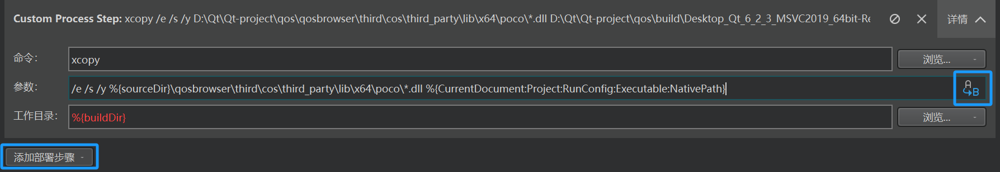
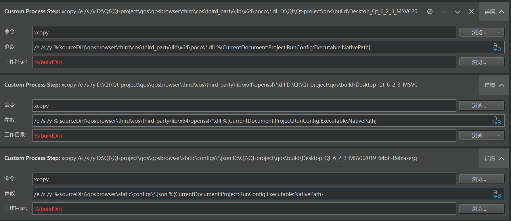
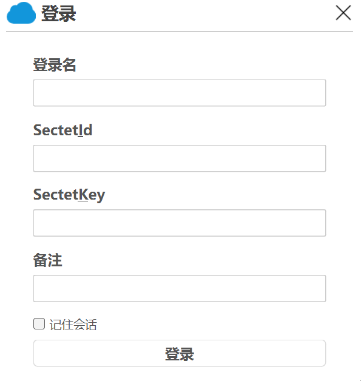
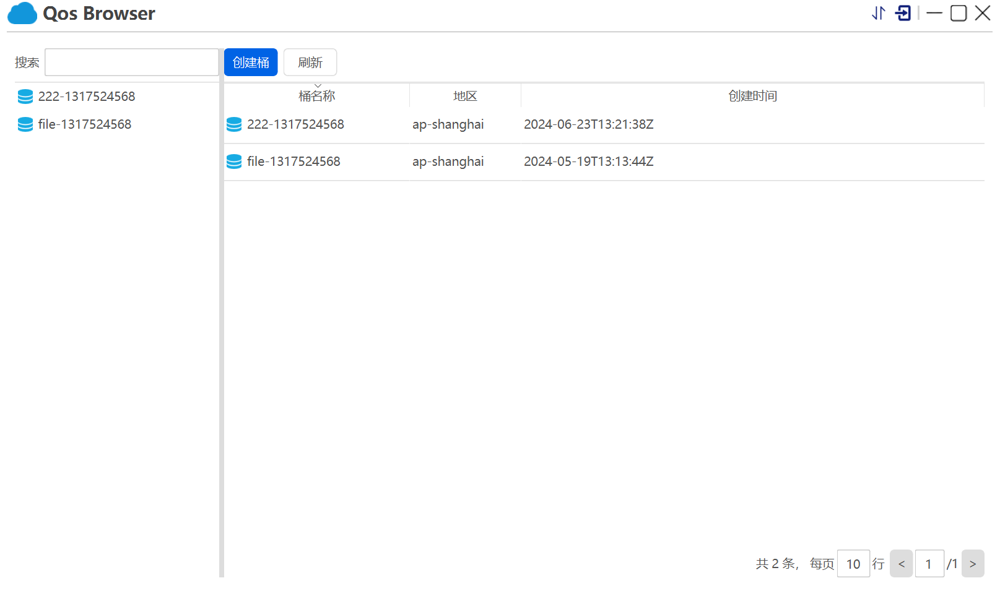
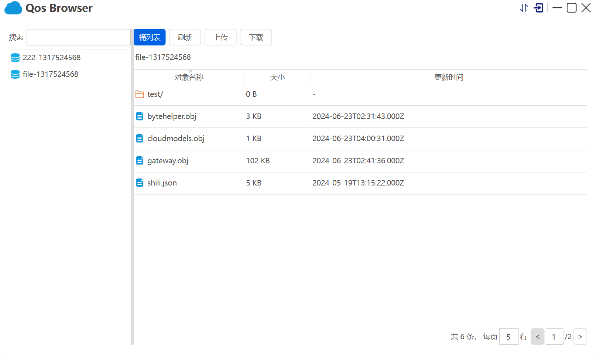

# CloudObjectStorageBrowser

## 编译环境

Windows + MSVC 2019 编译器 + Qt 6.2.3

## 项目构建前准备

###  申请腾讯云对象存储账号

**申请腾讯云账号**

https://cloud.tencent.com/

**注册**

点   产品——存储——对象存储（Cloud Object Storage，COS）——立即使用——激活

点控制台——对象存储，进入了

**创建子账户**

使用子账户最主要的是进行权限控制

鼠标移到右上角——访问管理，左边点用户——用户列表——新建用户——快速创建——填入用户名xxx——创建用户

在进入用户列表，给子用户xxx——授权——勾选 该策略允许您管理账户内所有云服务资源(除了财务的所有权限...——确定

**创建APIKEY**

点击fwk——API秘钥——新建秘钥，注意先保存 SecretKey !!!

### 编译部署SDK

**下载SDK**

如果使用的是 windows，可直接使用仓库中的已经编译好的库文件，如果报错，则需下载编译源码。

进入 对象存储控制台

左边，常用工具——SDK下载——C++ SDK 快速入门——新窗口查看文档（文档的快速入门一栏）

点   Linux 版本/Windows 版本/macOS 版本：XML Linux C++ SDK，Code，Download ZIP，名称为 <u>cos-cpp-sdk-v5-master</u>

**编译SDK**

刚刚文档中往下，找到     编译 Windows 版本 SDK，按提示操作

编译生成的静态库文件——名称为 <u>cossdk.lib</u>。

**导入SDK**

创建控制台程序 costest

拷贝到 main.cpp

```c++
#include "cos_api.h"
#include "cos_sys_config.h"
#include "cos_defines.h"

int main(int argc, char *argv[]) {
    // 1. 指定配置文件路径，初始化 CosConfig
    qcloud_cos::CosConfig config("./config.json");
    qcloud_cos::CosAPI cos(config);

    // 2. 构造查询存储桶列表的请求
    qcloud_cos::GetServiceReq req;
    qcloud_cos::GetServiceResp resp;
    qcloud_cos::CosResult result = cos.GetService(req, &resp);

    // 3. 获取响应信息
    const qcloud_cos::Owner& owner = resp.GetOwner();
    const std::vector<qcloud_cos::Bucket>& buckets = resp.GetBuckets();
    std::cout << "owner.m_id=" << owner.m_id << ", owner.display_name=" << owner.m_display_name << std::endl;

    for (std::vector<qcloud_cos::Bucket>::const_iterator itr = buckets.begin(); itr != buckets.end(); ++itr) {
        const qcloud_cos::Bucket& bucket = *itr;
        std::cout << "Bucket name=" << bucket.m_name << ", location="
            << bucket.m_location << ", create_date=" << bucket.m_create_date << std::endl;
    }

    // 4. 处理调用结果
    if (result.IsSucc()) {
        // 查询存储桶列表成功
    } else {
        // 查询存储桶列表失败，可以调用 CosResult 的成员函数输出错误信息，例如 requestID 等
        std::cout << "HttpStatus=" << result.GetHttpStatus() << std::endl;
        std::cout << "ErrorCode=" << result.GetErrorCode() << std::endl;
        std::cout << "ErrorMsg=" << result.GetErrorMsg() << std::endl;
        std::cout << "ResourceAddr=" << result.GetResourceAddr() << std::endl;
        std::cout << "XCosRequestId=" << result.GetXCosRequestId() << std::endl;
        std::cout << "XCosTraceId=" << result.GetXCosTraceId() << std::endl;
    }
}
```

我们在 对象存储 控制台的 <u>存储桶列表</u> 一栏 <u>创建存储桶</u>

创建的存储桶名称为 **file-1317524568**，在里面上传文件，假设为 shili.json，账号.txt


在 costest 文件夹下创建 third 文件夹，third 文件夹下创建 cos 文件夹

在 cos-cpp-sdk-v5-master 文件夹下拷贝 include、libs、third_party 文件夹到刚刚的 cos 文件夹下

把编译好的 cossdk.lib 拷贝到 third/cos/libs/x64 下

Qt 里右击 costest ——添加库——外部库——库文件（...\costest\third\cos\libs\x64\cossdk.lib），包含路径（...\costest\third\cos\include）

先运行看看，报错，D:\Qt\Qttest\costest\third\cos\include\cos_config.h:10: error: C1083: 无法打开包括文件: “Poco/JSON/Parser.h”: No such file or directory，缺少头文件

先拷贝 D:\Qt\Qttest\costest\third\cos\third_party\include 路径

在 costest.pro 文件修改

```
win32:CONFIG(release, debug|release): LIBS += -L$$PWD/third/cos/libs/x64/ -lcossdk
else:win32:CONFIG(debug, debug|release): LIBS += -L$$PWD/third/cos/libs/x64/ -lcossdk
else:unix: LIBS += -L$$PWD/third/cos/libs/x64/ -lcossdk
    
INCLUDEPATH += $$PWD/third/cos/include \
    $$PWD/third/cos/third_party/include
DEPENDPATH += $$PWD/third/cos/include \
    $$PWD/third/cos/third_party/include
```

Qt 左下角切换成 Release

再运行，报错，LNK1104: 无法打开文件“PocoFoundation.lib”

在 third/cos 中查找 PocoFoundation.lib 文件

复制它64位的文件路径 D:\Qt\Qttest\costest\third\cos\third_party\lib\x64\poco

在 costest.pro 文件修改

```
win32:CONFIG(release, debug|release): LIBS += -L$$PWD/third/cos/libs/x64/ -lcossdk
else:win32:CONFIG(debug, debug|release): LIBS += -L$$PWD/third/cos/libs/x64/ -lcossdk
else:unix: LIBS += -L$$PWD/third/cos/libs/x64/ -lcossdk

win32:CONFIG(release, debug|release): LIBS += -L$$PWD/third/cos/third_party/lib/x64/poco -lPocoFoundation
else:win32:CONFIG(debug, debug|release): LIBS += -L$$PWD/third/cos/third_party/lib/x64/poco -lPocoFoundation
else:unix: LIBS += -L$$PWD/third/cos/third_party/lib/x64/poco -lPocoFoundation

INCLUDEPATH += $$PWD/third/cos/include \
    $$PWD/third/cos/third_party/include
DEPENDPATH += $$PWD/third/cos/include \
    $$PWD/third/cos/third_party/include
```

再运行，提示 **找不到 ...dll 文件**，说明缺少动态库（cos 依赖的）

在 third\cos\third_party\lib\x64\poco 下复制所有 dll 文件到 costest\build\Desktop_Qt_6_2_3_MSVC2019_64bit-Release\release 文件夹下

在 costest\third\cos\third_party\lib\x64\openssl 下复制所有 dll 文件到 costest\build\Desktop_Qt_6_2_3_MSVC2019_64bit-Release\release 文件夹下

回到 Qt，再运行

控制台显示 failed to open config file ./config.json

因为没创建这个配置文件

在 costest 目录下创建 config.json 文件

```json
{
"SecretId":"********************************", // sercret_id 替换为用户的 SecretId，建议使用子账号密钥，授权遵循最小权限指引，降低使用风险。子账号密钥获取可参见 https://cloud.tencent.com/document/product/598/37140
"SecretKey":"*******************************", // sercret_key 替换为用户的 SecretKey，建议使用子账号密钥，授权遵循最小权限指引，降低使用风险。子账号密钥获取可参见 https://cloud.tencent.com/document/product/598/37140
"Region":"ap-guangzhou",                // 存储桶地域, 替换为客户存储桶所在地域，可以在COS控制台指定存储桶的概览页查看存储桶地域信息，参见 https://console.cloud.tencent.com/cos5/bucket/ ，关于地域的详情见 https://cloud.tencent.com/document/product/436/6224
"SignExpiredTime":360,              // 签名超时时间, 单位s
"ConnectTimeoutInms":6000,          // connect 超时时间, 单位ms
"ReceiveTimeoutInms":60000,         // recv 超时时间, 单位ms
"UploadPartSize":10485760,          // 上传文件分块大小，1M~5G, 默认为10M
"UploadCopyPartSize":20971520,      // 上传复制文件分块大小，5M~5G, 默认为20M
"UploadThreadPoolSize":5,           // 单文件分块上传线程池大小
"DownloadSliceSize":4194304,        // 下载文件分块大小
"DownloadThreadPoolSize":5,         // 单文件下载线程池大小
"AsynThreadPoolSize":2,             // 异步上传下载线程池大小
"LogoutType":1,                     // 日志输出类型,0:不输出,1:输出到屏幕,2输出到 syslog
"LogLevel":3,                       // 日志级别:1: ERR, 2: WARN, 3:INFO, 4:DBG
"IsDomainSameToHost":false,         // 是否使用专有的 host
"DestDomain":"",                    // 特定 host
"IsUseIntranet":false,              // 是否使用特定ip和端口号
"IntranetAddr":""                   // 特定 ip 和端口号,例如“127.0.0.1:80”
}
```

填入 SecretId，SecretKey

```c++
// main.cpp  修改
qcloud_cos::CosConfig config("D:/Qt/Qttest/costest/config.json");
```

运行，成功

```
upload_part_size:10485760
upload_copy_part_size:20971520
sign_expire_in_s:360
conn_timeout_in_ms:6000
recv_timeout_in_ms:60000
threadpool_size:5
asyn_threadpool_size:2
log_outtype:1
log_level:3
down_thread_pool_size:5
down_slice_size:4194304
is_domain_same_to_host:0
dest_domain:
is_use_intranet:0
intranet_addr:
keepalive:0
keepidle:20
keepintvl:5
[INFO] :SendRequest(99) send request to [http://service.cos.myqcloud.com/]
[INFO] :SendRequest(279) Send request over, status=200, reason=OK
[WARN] :ParseFromXmlString(90) Unknown field, field_name=Marker, xml_body=<ListAllMyBucketsResult>
	<Owner>
		<ID>qcs::cam::uin/100030463276:uin/100030463276</ID>
		<DisplayName>100030463276</DisplayName>
	</Owner>
	<Marker/>
	<NextMarker/>
	<IsTruncated>false</IsTruncated>
	<Buckets>
		<Bucket>
			<Name>file-1317524568</Name>
			<Location>ap-shanghai</Location>
			<CreationDate>2024-05-19T13:13:44Z</CreationDate>
			<BucketType>cos</BucketType>
		</Bucket>
	</Buckets>
</ListAllMyBucketsResult>


[WARN] :ParseFromXmlString(90) Unknown field, field_name=NextMarker, xml_body=<ListAllMyBucketsResult>
	<Owner>
		<ID>qcs::cam::uin/100030463276:uin/100030463276</ID>
		<DisplayName>100030463276</DisplayName>
	</Owner>
	<Marker/>
	<NextMarker/>
	<IsTruncated>false</IsTruncated>
	<Buckets>
		<Bucket>
			<Name>file-1317524568</Name>
			<Location>ap-shanghai</Location>
			<CreationDate>2024-05-19T13:13:44Z</CreationDate>
			<BucketType>cos</BucketType>
		</Bucket>
	</Buckets>
</ListAllMyBucketsResult>


[WARN] :ParseFromXmlString(90) Unknown field, field_name=IsTruncated, xml_body=<ListAllMyBucketsResult>
	<Owner>
		<ID>qcs::cam::uin/100030463276:uin/100030463276</ID>
		<DisplayName>100030463276</DisplayName>
	</Owner>
	<Marker/>
	<NextMarker/>
	<IsTruncated>false</IsTruncated>
	<Buckets>
		<Bucket>
			<Name>file-1317524568</Name>
			<Location>ap-shanghai</Location>
			<CreationDate>2024-05-19T13:13:44Z</CreationDate>
			<BucketType>cos</BucketType>
		</Bucket>
	</Buckets>
</ListAllMyBucketsResult>


[WARN] :ParseFromXmlString(78) Unknown field in Bucket node, field_name=BucketType, xml_body=<ListAllMyBucketsResult>
	<Owner>
		<ID>qcs::cam::uin/100030463276:uin/100030463276</ID>
		<DisplayName>100030463276</DisplayName>
	</Owner>
	<Marker/>
	<NextMarker/>
	<IsTruncated>false</IsTruncated>
	<Buckets>
		<Bucket>
			<Name>file-1317524568</Name>
			<Location>ap-shanghai</Location>
			<CreationDate>2024-05-19T13:13:44Z</CreationDate>
			<BucketType>cos</BucketType>
		</Bucket>
	</Buckets>
</ListAllMyBucketsResult>

owner.m_id=qcs::cam::uin/100030463276:uin/100030463276, owner.display_name=100030463276
Bucket name=file-1317524568, location=ap-shanghai, create_date=2024-05-19T13:13:44Z
```

最后，打印了存储桶名称 file-1317524568，地域 ap-shanghai，创建时间 2024-05-19T13:13:44Z


## 项目构建

1、使用的是腾讯云的 release 版本，所以构建项目的时候，要使用 release 版本

2、注意，运行的时候需要动态库，拷贝 qos\qosbrowser\third\cos\third_party\lib\x64\poco 和 openssl 下的所有 dll 文件到 qos\build\Desktop_Qt_6_2_3_MSVC2019_64bit-Release\qosbrowser\release 下

3、拷贝 qos\qosbrowser\static\configs 下的 cosconfig.json 文件到 qos\build\Desktop_Qt_6_2_3_MSVC2019_64bit-Release\qosbrowser\release 下

⚠️【或者】

**增加部署环节拷贝动态库和配置文件**

之前需要拷贝 dll 和 配置文件，比较麻烦，我们可以使用部署功能

侧边栏选择项目，新的界面左边 构建和运行 里选择运行，点击添加部署步骤——Custom Process Step



sourceDir 是到 qos 的，顶上有效验信息可以查看变量的值

参数里的变量是在左右侧点击插入的，这只是一个poco，还有 openssl 里的和 配置文件，再点击 添加部署步骤



我们删除掉刚才手动添加到 .../release 下的 dll 和配置文件

我们右击 qos，部署，发现 dll 文件和配置文件都拷贝过来了，运行，成功


## 界面展示







## 安装包

可直接下载安装包体验

已上传  <u>qosbrowser_setup_0.0.1.exe</u>